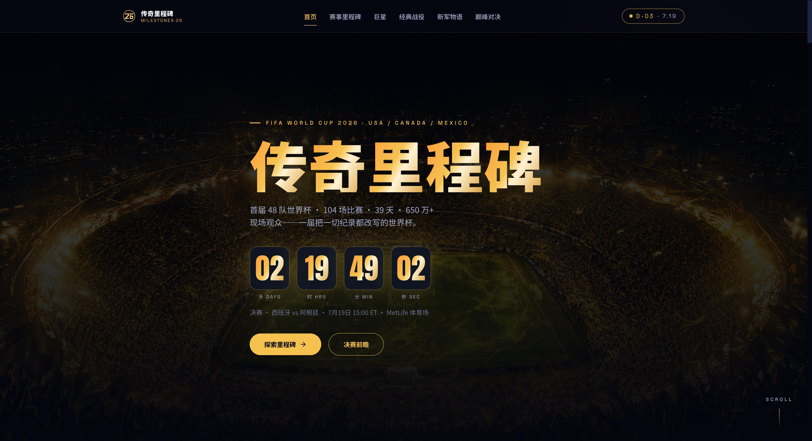
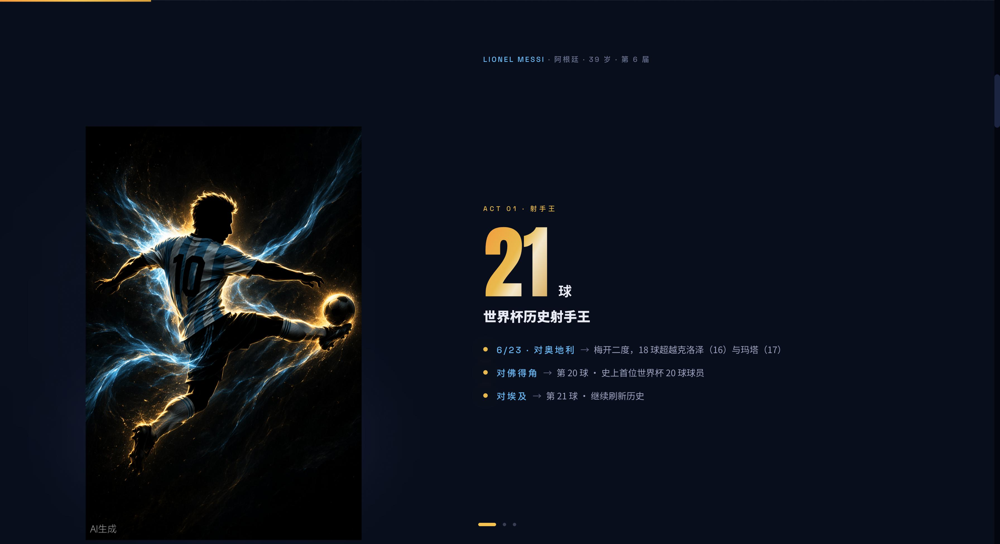
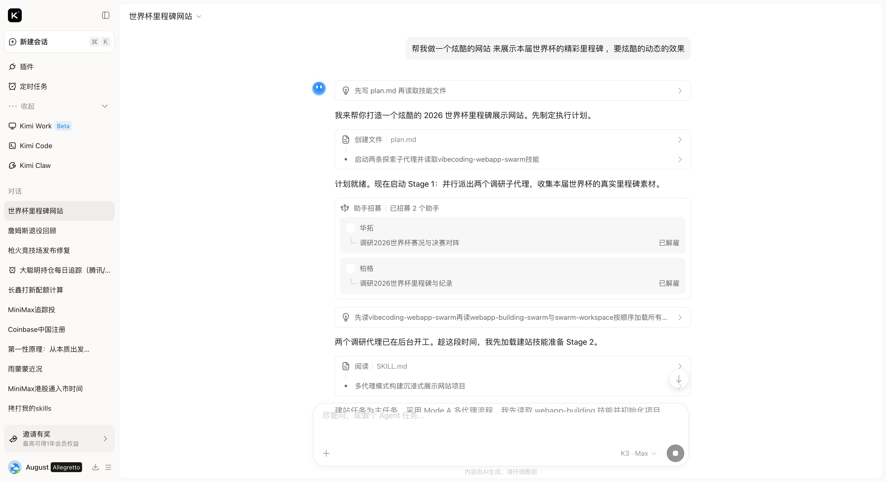
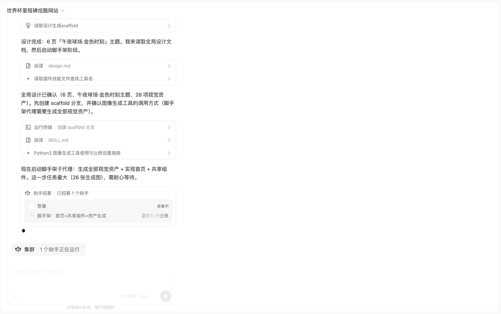
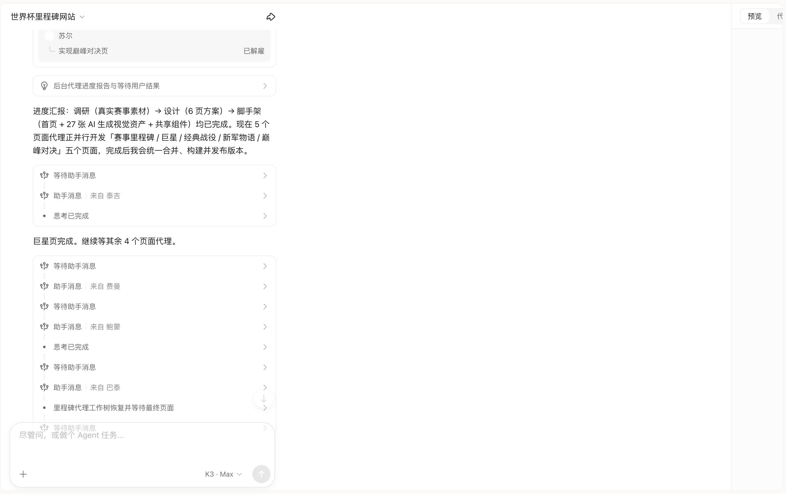
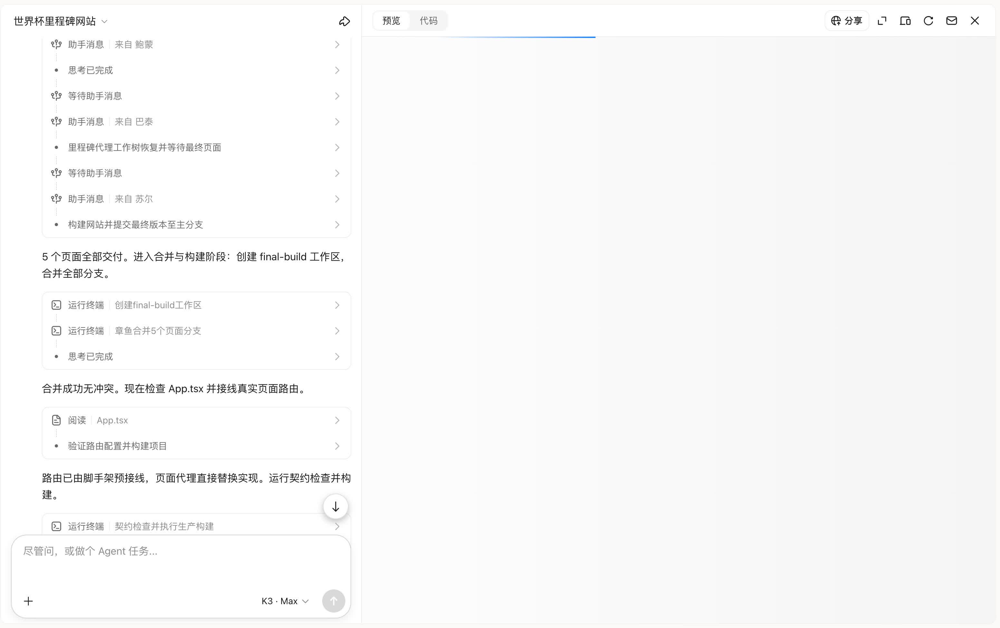
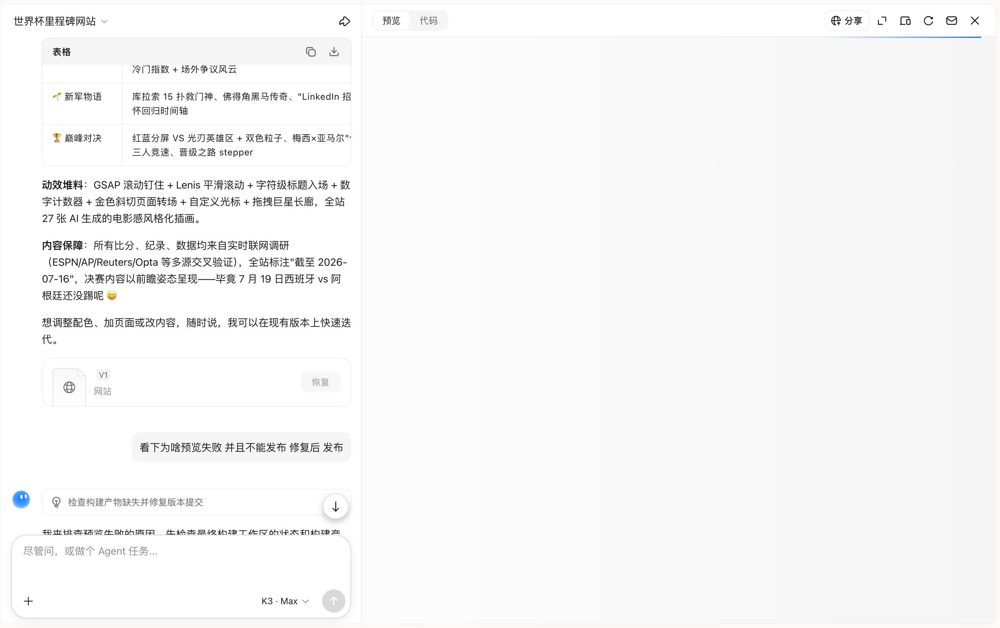

# Milestones·26 — 2026 FIFA World Cup ⚽🏆

> One prompt → a Kimi K3 agent swarm (research + design + 6 build agents) → an animated, data-driven World Cup milestones site. **Zero human-written code.**

[🇨🇳 中文文档](README.zh-CN.md) · [🌐 **Live Site**](https://l3lpakqodhark.ok.kimi.link) · [How the swarm built it](#-how-the-k3-swarm-built-this--the-honest-story)


**「午夜球场 · 金色时刻」— a midnight-stadium, golden-moment themed showcase of the wildest World Cup ever: 48 teams, 104 matches, 3 host countries, 6.5M+ fans.**

## 🌐 Visit

**Online:** https://l3lpakqodhark.ok.kimi.link (hosted on Kimi)

**Local:**

```bash
npm install
npm run dev                  # dev mode
# or
npm run build && npm run preview   # production build + preview
```

## ✨ What's Inside

Six pages, all content researched live by the swarm during the actual tournament (data as of 2026-07-16, post-semifinals):

- **首页 Home** — cinematic hero over an AI-generated night stadium, live countdown to the July 19 final (Spain vs Argentina, MetLife)
- **赛事里程碑 Milestones** — the records this tournament rewrote: first 48-team WC, first 3-nation host, longest schedule, attendance record
- **巨星 Legends** — Messi's 21st WC goal (all-time top scorer), Ronaldo's farewell, Yamal's rise…
- **经典战役 Matches** — the knockout classics, recreated as animated cards
- **新军物语 Newcomers** — Curaçao's 15-save goalkeeper, Cape Verde's underdog run, Jordan, Uzbekistan
- **巅峰对决 Final** — Spain vs Argentina preview: red/blue split hero, Messi × Yamal race chart, road-to-final stepper



### Design & motion

- 🎨 "Midnight stadium × golden moment" art direction: dark base, gold/cyan accents
- 🖼 **27 AI-generated visuals** — player portraits, match scenes, stadium hero, the trophy
- 🎬 GSAP scroll pinning + Lenis smooth scroll + per-character title reveals + animated counters + golden diagonal page transitions + custom cursor + draggable legends rail, plus a Three.js particle field
- 📊 Every fact (scores, records, dates) cross-validated live from ESPN/AP/Reuters/Opta — fabrication was explicitly forbidden in the plan



## 🛠 Tech Stack

React 19 · TypeScript · Vite · Tailwind CSS · Three.js (@react-three/fiber) · GSAP · Framer Motion · Lenis

## 🐝 How the K3 Swarm Built This — the honest story

The only human input was one sentence:

> 「帮我做一个炫酷的网站 来展示本届世界杯的精彩里程碑，要炫酷的动态的效果」

### 1️⃣ Plan first — and facts first

The orchestrator wrote [`docs/process/plan.md`](docs/process/plan.md) before any code: live research was mandatory, fabrication explicitly forbidden, static delivery at the end.

### 2️⃣ Parallel research agents with real rigor

Two agents fanned out — **华拓** (results & the final matchup) and **柏格** (milestones & records) — and cross-validated everything across ESPN/AP/Reuters/Opta. When sources disagreed (e.g. Cape Verde's group finish), the agents did the points math themselves instead of trusting headlines. All content is labeled "截至 2026-07-16", and the final is honestly presented as a *preview* — "毕竟 7 月 19 日还没踢呢 😄".



### 3️⃣ Design lock & asset factory

A 6-page「午夜球场·金色时刻」system with 28 planned assets. Scaffold agent **黎曼** generated 27 cinematic images (image tool), built the Home page and the shared component library.



### 4️⃣ 💥 Five parallel page agents — one got its worktree wiped

Milestones / Legends / Matches / Newcomers / Final were built in parallel on separate git branches. Mid-flight, the milestones agent's worktree **got wiped by a concurrent-operations issue** — the swarm noticed, recovered it, and kept the other four running.



### 5️⃣ Octopus merge & contract checks

All five branches landed in a single **octopus merge, zero conflicts**. Routes were pre-wired by the scaffold (page agents replaced stub files directly), then contract checks + production build passed.



### 6️⃣ 💥 The release stumbled twice — and fixed itself both times

- **V1 `94a88ec`**: the version snapshot missed `dist/` (killed by `.gitignore`) → preview dead. The swarm diagnosed it, rebuilt, force-committed 35 dist files → **V2 `e1907a4`**.
- Platform preview kept flaking → rebuilt snapshot → **V3 `f97853e`**, the version live today.
- Bonus catch: the "all files" workspace was later found stuck at the old scaffold state (branch pointers moved, worktree didn't) — root-caused and re-synced.



### 📊 Scorecard

- ✅ Real research with source cross-validation · honest data labeling · 27 self-made visuals · 6-agent parallel build · octopus merge · twice self-healed releases
- 💥 Agent worktree wiped mid-task (recovered) · V1 snapshot missing dist (fixed in V2) · stale workspace snapshot (fixed after export)

## 📂 Structure

```
src/
├── pages/         # Home / Milestones / Legends / Matches / Newcomers / Final
├── sections/      # home sections (Hero, ParticleField, NumbersGallery, …)
├── components/    # shared UI (GlowCard, ScorePill, CustomCursor, …)
└── lib/
public/            # 27 AI-generated images
docs/process/      # the swarm's own artifacts (plan.md, design notes)
```

## 🎁 Try Kimi K3 Yourself

通过我的邀请链接注册 Kimi，双方 100% 拿奖，最高可得 1 年会员等值权益 👉 [点击助力](https://kimi-bot.com/activities/zh-cn/viral-referral/share?scenario=invite&from=share_poster&invitation_code=YZYK4)

<a href="https://kimi-bot.com/activities/zh-cn/viral-referral/share?scenario=invite&from=share_poster&invitation_code=YZYK4">
  
</a>

---

Also built by the same swarm: [kimi-k3-fps-arena](https://github.com/genglintong/kimi-k3-fps-arena) — a playable browser arena shooter vs AI bots.

Built with [Kimi K3](https://www.kimi.com) swarm mode. If AI-built sites impress you, drop a ⭐.
